---
# 当前页面内容标题
title: 04、HTML&CSS
# 分类
category:
    - web
    - javaweb
    - HTML
    - CSS
# 标签
tag:
    - web
    - HTML
    - CSS
sticky: false
# 是否收藏在博客主题的文章列表中，当填入数字时，数字越大，排名越靠前。
star: false
# 是否将该文章添加至文章列表中
article: true
# 是否将该文章添加至时间线中
timeline: true
---

# 04、HTML&CSS

## 一、HTML 简介

> 参考文章：<https://www.cnblogs.com/zhaostudy/p/16685971.html>

### 1、名词解释

HTML 是**H**yper **T**ext **M**arkup **L**anguage 的缩写。意思是**『超文本标记语言』**。

### 2、超文本

HTML 文件本质上是文本文件，而普通的文本文件只能显示字符。但是 HTML 技术则通过 HTML 标签把其他网页、图片、音频、视频等各种多媒体资源引入到当前网页中，让网页有了非常丰富的呈现方式，这就是超文本的含义——本身是文本，但是呈现出来的最终效果超越了文本。

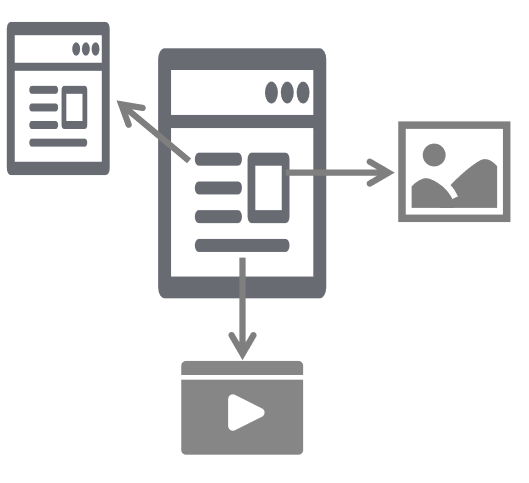

### 3、标记语言

说 HTML 是一种『标记语言』是因为它不是向 Java 这样的『编程语言』，因为它是由一系列『标签』组成的，没有常量、变量、流程控制、异常处理、IO 等等这些功能。HTML 很简单，每个标签都有它固定的含义和确定的页面显示效果。

> 标签是通过一组尖括号+标签名的方式来定义的：

```html
<p>HTML is a very popular fore-end technology.</p>
```

> 这个例子中使用了一个 p 标签来定义一个段落，叫**『开始标签』**，叫**『结束标签』。
> 开始标签和结束标签一起构成了一个完整的标签。开始标签和结束标签之间的部分叫『文本标签体』**，也简称**『标签体』**。
> `有的时候标签里还带有**『属性』**：

```html
<a href="http://www.xxx.com">show detail</a>
```

href="http://www.xxx.com"就是属性，href是**『属性名』**，"http://www.xxx.com"是**『属性值』**。

还有一种标签是**『单标签』**：

```html
<input type="text" name="username" />
```

### 4、HelloWorld

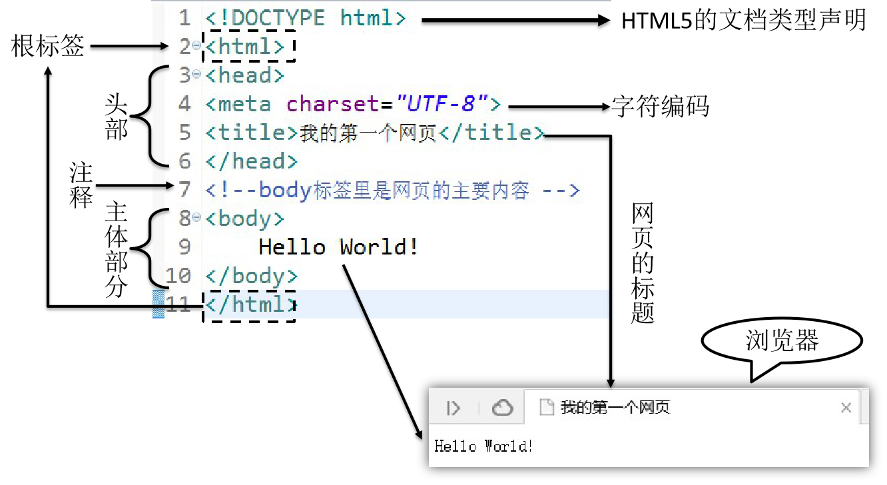

### 5、HTML 文件结构

#### 文档类型声明

HTML 文件中第一行的内容，用来告诉浏览器当前 HTML 文档的基本信息，其中最重要的就是当前 HTML 文档遵循的语法标准。这里我们只需要知道 HTML 有 4 和 5 这两个大的版本，HTML4 版本的文档类型声明是：

```html
<!DOCTYPE html PUBLIC "-//W3C//DTD HTML 4.01 Transitional//EN" "http://www.w3.org/TR/html4/loose.dtd">
```

HTML5 版本的文档类型声明是：

```html
<!DOCTYPE html>
```

现在主流的技术选型都是使用 HTML5，之前的版本基本不用了。

历史上 HTML 的各个版本：

| 版本名称 | 年份 |
| :------: | :--: |
|   HTML   | 1991 |
|  HTML+   | 1993 |
| HTML2.0  | 1995 |
| HTML3.2  | 1997 |
| HTML4.01 | 1999 |
| XHTML1.0 | 2000 |
|  HTML5   | 2012 |
|  XHTML5  | 2013 |

#### 根标签

html 标签是整个文档的根标签，所有其他标签都必须放在 html 标签里面。上面的文档类型不能当做普通标签看待。

> 所谓『根』其实是『树根』的意思。在一个树形结构中，根节点只能有一个。

#### 头部

head 标签用于定义文档的头部，其他头部元素都放在 head 标签里。头部元素包括 title 标签、script 标签、style 标签、link 标签、meta 标签等等。

#### 主体

body 标签定义网页的主体内容，在浏览器窗口内显示的内容都定义到 body 标签内。

#### 注释

HTML 注释的写法是：

```html
<!-- 注释内容 -->
```

注释的内容不会显示到浏览器窗口内，是开发人员用来对代码内容进行解释说明。

### 6、HTML 语法规则

-   根标签有且只能有一个
-   无论是双标签还是单标签都必须正确关闭
-   标签可以嵌套但不能交叉嵌套
-   注释不能嵌套
-   属性必须有值，值必须加引号，单引号或双引号均可
-   标签名不区分大小写但建议使用小写

## 二、使用 HTML 展示文章

以文章的组织形式展示数据是 HTML 最基本的功能了，网页上显示的文章在没有做任何 CSS 样式设定的情况下如下图所示：

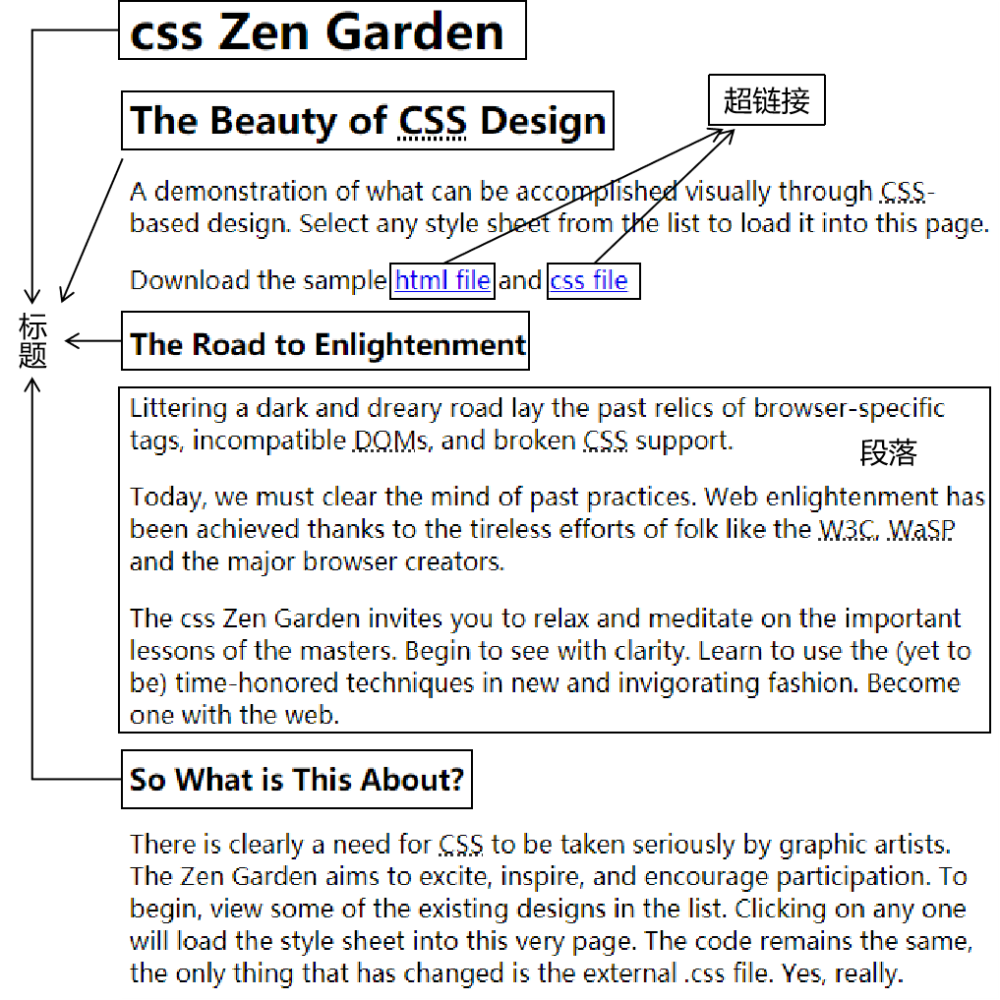

本节我们要学习的 HTML 标签如下表：

| 标签名称 |          功能          |
| :------: | :--------------------: |
|  h1~h6   |   1 级标题~6 级标题    |
|    p     |          段落          |
|    a     |         超链接         |
|  ul/li   |        无序列表        |
|   img    |          图片          |
|   div    | 定义一个前后有换行的块 |
|   span   | 定义一个前后无换行的块 |

为了方便编写代码，我们在 IDEA 中创建一个静态 Web 工程来操作：

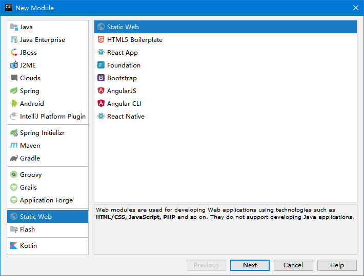

### 1、标题标签

#### 代码

```html
<!DOCTYPE html>
<html lang="en">
	<head>
		<meta charset="UTF-8" />
		<title>Title</title>
	</head>
	<body>
		<h1>这是一级标题</h1>
		<h2>这是二级标题</h2>
		<h3>这是三级标题</h3>
		<h4>这是四级标题</h4>
		<h5>这是五级标题</h5>
		<h6>这是六级标题</h6>
	</body>
</html>
```

#### 页面显示效果

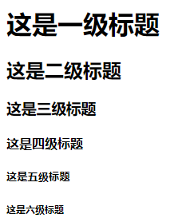

**注意**：标题标签前后有换行。

### 2、段落标签

#### 代码

```html
<p>
	There is clearly a need for CSS to be taken seriously by graphic artists. The Zen Garden aims to excite, inspire,
	and encourage participation. To begin, view some of the existing designs in the list. Clicking on any one will load
	the style sheet into this very page. The code remains the same, the only thing that has changed is the external .css
	file. Yes, really.
</p>
```

#### 页面显示效果

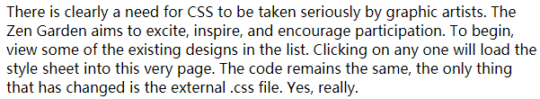

**注意**：段落标签前后有换行。

### 3、超链接

#### 代码

```html
<a href="page02-anchor-target.html">点我跳转到下一个页面</a>
```

#### 页面显示效果

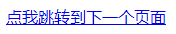

点击后跳转到 href 属性指定的页面

### 4、路径

在我们整个 Web 开发技术体系中，『路径』是一个贯穿始终的重要概念。凡是需要获取另外一个资源的时候都需要用到路径。要想理解路径这个概念，我们首先要认识一个概念：『文件系统』。

#### 文件系统

我们写代码的时候通常都是在 Windows 系统来操作，而一个项目开发完成后想要让所有人都能够访问到就必须『部署』到服务器上，也叫『发布』。而服务器通常是 Linux 系统。

Windows 系统和 Linux 系统的文件系统有很大差别，为了让我们编写的代码不会因为从 Windows 系统部署到了 Linux 系统而出现故障，实际开发时不允许使用**物理路径**。

> 物理路径举例：
>
> D:\aaa\pro01-HTML\page01-article-tag.html
>
> D:\aaa\pro01-HTML\page02-anchor-target.html

幸运的是不管是 Windows 系统还是 Linux 系统环境下，目录结构都是**树形结构**，编写路径的规则是一样的。


所以我们**以项目的树形目录结构为依据**来编写路径就不用担心操作系统平台发生变化之后路径错误的问题了。有了这个大前提，我们具体编写路径时有两种具体写法：

-   相对路径
-   绝对路径（建议使用）

#### 相对路径

**相对路径都是以\*\*『当前位置』\*\*为基准**来编写的。假设我们现在正在浏览 a 页面，想在 a 页面内通过超链接跳转到 z 页面。

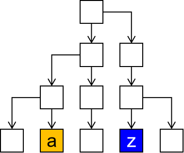

那么按照相对路径的规则，我们现在所在的位置是 a.html 所在的 b 目录：

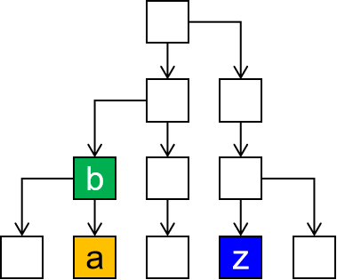

z.html 并不在 b 目录下，所以我们要从 b 目录出发，向上走，进入 b 的父目录——c 目录：

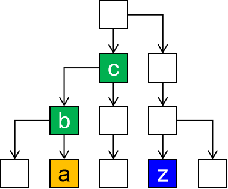

c 目录还是不行，继续向上走，进入 c 的父目录——d 目录：

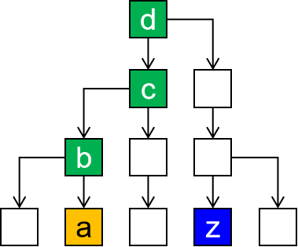

在从 d 目录向下经过两级子目录——e 目录、f 目录才能找到 z.html：

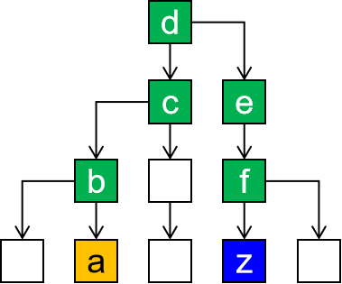

所以整个路径的写法是：

```html
<a href="../../e/f/z.html">To z.html</a>
```

可以看到使用相对路径有可能会很繁琐，而且在后面我们结合了在服务器上运行的 Java 程序后，相对路径的基准是有可能发生变化的，所以**不建议使用相对路径**。

#### 绝对路径

##### 通过 IDEA 服务器打开 HTML 文件

测试绝对路径的前提是通过 IDEA 的内置服务器访问我们编写的 HTML 页面——这样访问地址的组成结构才能和我们以后在服务器上运行的 Java 程序一致。

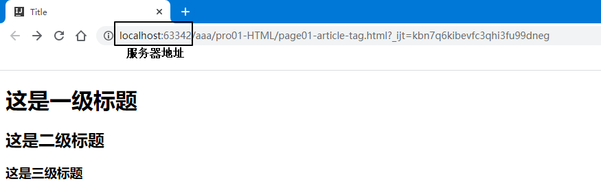

##### 服务器访问地址的组成


##### 绝对路径的写法

绝对路径要求必须是以**『正斜线』**开头。这个开头的正斜线在整个服务器访问地址中对应的位置如下图所示：


这里标注出的这个位置代表的是**『服务器根目录』**，从这里开始我们就是在服务器的内部查找一个具体的 Web 应用。

所以我们编写绝对路径时就从这个位置开始，**按照目录结构找到目标文件**即可。拿前面相对路径中的例子来说，我们想在 a.html 页面中通过超链接访问 z.html。此时路径从正斜线开始，和 a.html 自身所在位置没有任何关系：

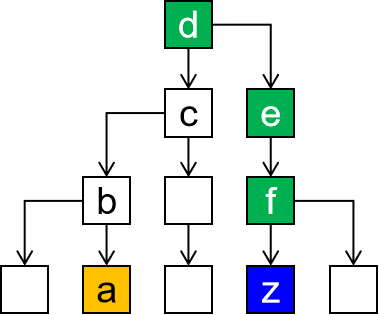

```html
<a href="/d/e/f/z.html">To z.html</a>
```

##### 具体例子

编写超链接访问下面的页面：

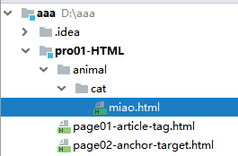

```html
<a href="/aaa/pro01-HTML/animal/cat/miao.html">Cat Page</a>
```

##### 小结

为了和我们后面学习的内容和正确的编码方式保持一致，建议大家从现在开始就使用绝对路径。

### 5、换行

#### 代码

```html
We would like to see as much CSS1 as possible. CSS2 should be limited to widely-supported elements only. The css Zen
Garden is about functional, practical CSS and not the latest bleeding-edge tricks viewable by 2% of the browsing public.
<br />
The only real requirement we have is that your CSS validates.
```

#### 页面显示效果

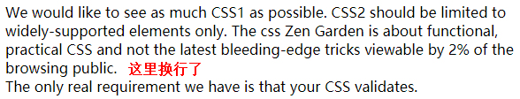

### 6、无序列表

#### 代码

```html
<ul>
	<li>Apple</li>
	<li>Banana</li>
	<li>Grape</li>
</ul>
```

#### 页面显示效果

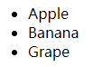

### 7、图片

#### 准备图片文件

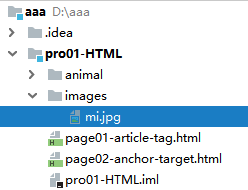

#### 代码

src 属性用来指定图片文件的路径，这里同样按我们前面说的使用**『绝对路径』**。

```html

```

#### 页面显示效果

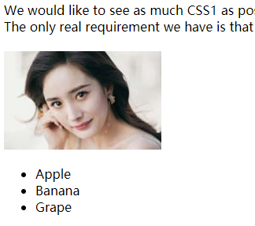

### 8、块

**『块』**并不是为了显示文章内容的，而是为了方便结合 CSS 对页面进行布局。块有两种，div 是前后有换行的块，span 是前后没有换行的块。

把下面代码粘贴到 HTML 文件中查看他们的区别：

```html
<div style="border: 1px solid black;width: 100px;height: 100px;">This is a div block</div>
<div style="border: 1px solid black;width: 100px;height: 100px;">This is a div block</div>

<span style="border: 1px solid black;width: 100px;height: 100px;">This is a span block</span>
<span style="border: 1px solid black;width: 100px;height: 100px;">This is a span block</span>
```

页面显示效果为：

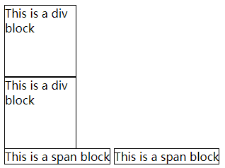

### 9、HTML 实体

在 HTML 文件中，<、>等等这样的符号已经被赋予了特定含义，不会作为符号本身显示到页面上，此时如果我们想使用符号本身怎么办呢？那就是使用 HTML 实体来转义。

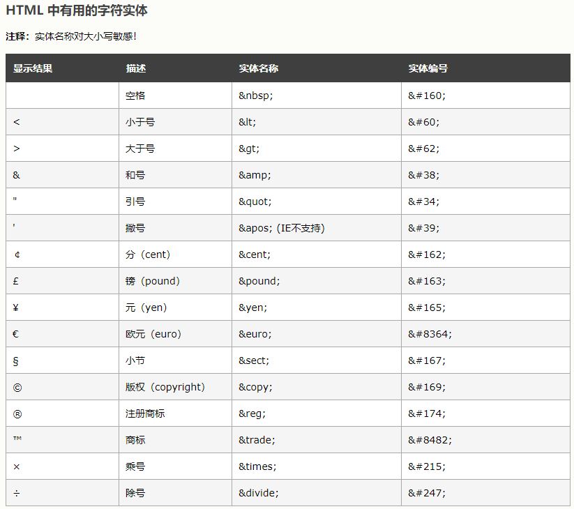

## 三、使用 HTML 收集表格数据

> 参考文章：
>
> [HTML DOM Table 对象 (w3school.com.cn)](https://www.w3school.com.cn/jsref/dom_obj_table.asp)

### Table 对象

Table 对象代表一个 HTML 表格。

> 在 HTML 文档中 < table > 标签每出现一次，一个 Table 对象就会被创建。

### Table 对象集合

|                                集合                                |                 描述                  |
| :----------------------------------------------------------------: | :-----------------------------------: |
| [cells[\]](https://www.w3school.com.cn/jsref/coll_table_cells.asp) | 返回包含表格中所有单元格的一个数组。  |
|  [rows[\]](https://www.w3school.com.cn/jsref/coll_table_rows.asp)  |   返回包含表格中所有行的一个数组。    |
|                             tBodies[]                              | 返回包含表格中所有 tbody 的一个数组。 |

### Table 对象属性

|                                    属性                                     |                         描述                         |
| :-------------------------------------------------------------------------: | :--------------------------------------------------: |
|                                    align                                    |         表在文档中的水平对齐方式。（已废弃）         |
|                                   bgColor                                   |               表的背景颜色。（已废弃）               |
|      [border](https://www.w3school.com.cn/jsref/prop_table_border.asp)      |              设置或返回表格边框的宽度。              |
|     [caption](https://www.w3school.com.cn/jsref/prop_table_caption.asp)     |          对表格的 < caption > 元素的引用。           |
| [cellPadding](https://www.w3school.com.cn/jsref/prop_table_cellpadding.asp) |    设置或返回单元格内容和单元格边框之间的空白量。    |
| [cellSpacing](https://www.w3school.com.cn/jsref/prop_table_cellspacing.asp) |       设置或返回在表格中的单元格之间的空白量。       |
|       [frame](https://www.w3school.com.cn/jsref/prop_table_frame.asp)       |              设置或返回表格的外部边框。              |
|          [id](https://www.w3school.com.cn/jsref/prop_table_id.asp)          |                设置或返回表格的 id。                 |
|       [rules](https://www.w3school.com.cn/jsref/prop_table_rules.asp)       |          设置或返回表格的内部边框（行线）。          |
|     [summary](https://www.w3school.com.cn/jsref/prop_table_summary.asp)     |           设置或返回对表格的描述（概述）。           |
|                                    tFoot                                    | 返回表格的 TFoot 对象。如果不存在该元素，则为 null。 |
|                                    tHead                                    | 返回表格的 THead 对象。如果不存在该元素，则为 null。 |
|       [width](https://www.w3school.com.cn/jsref/prop_table_width.asp)       |                设置或返回表格的宽度。                |

### 标准属性

|                               属性                                |             描述              |
| :---------------------------------------------------------------: | :---------------------------: |
| [className](https://www.w3school.com.cn/jsref/prop_classname.asp) | 设置或返回元素的 class 属性。 |
|       [dir](https://www.w3school.com.cn/jsref/prop_dir.asp)       |    设置或返回文本的方向。     |
|      [lang](https://www.w3school.com.cn/jsref/prop_lang.asp)      |  设置或返回元素的语言代码。   |
|     [title](https://www.w3school.com.cn/jsref/prop_title.asp)     | 设置或返回元素的 title 属性。 |

### Table 对象方法

| 方法                                                                             | 描述                                |
| :------------------------------------------------------------------------------- | :---------------------------------- |
| [createCaption()](https://www.w3school.com.cn/jsref/met_table_createcaption.asp) | 为表格创建一个 caption 元素。       |
| [createTFoot()](https://www.w3school.com.cn/jsref/met_table_createtfoot.asp)     | 在表格中创建一个空的 tFoot 元素。   |
| [createTHead()](https://www.w3school.com.cn/jsref/met_table_createthead.asp)     | 在表格中创建一个空的 tHead 元素。   |
| [deleteCaption()](https://www.w3school.com.cn/jsref/met_table_deletecaption.asp) | 从表格删除 caption 元素以及其内容。 |
| [deleteRow()](https://www.w3school.com.cn/jsref/met_table_deleterow.asp)         | 从表格删除一行。                    |
| [deleteTFoot()](https://www.w3school.com.cn/jsref/met_table_deletetfoot.asp)     | 从表格删除 tFoot 元素及其内容。     |
| [deleteTHead()](https://www.w3school.com.cn/jsref/met_table_deletethead.asp)     | 从表格删除 tHead 元素及其内容。     |
| [insertRow()](https://www.w3school.com.cn/jsref/met_table_insertrow.asp)         | 在表格中插入一个新行。              |

### 水果库存案例

HTML 代码

```html
<div id="div_container">
	<div id="div_fruit_list">
		<table id="tbl_fruit">
			<tr>
				<td class="w20">名称</td>
				<td class="w20">单价</td>
				<td class="w20">数量</td>
				<td class="w20">小计</td>
				<td>操作</td>
			</tr>
			<tr>
				<td>苹果</td>
				<td>3</td>
				<td>100</td>
				<td>60</td>
				<td><a href="#">删除</a></td>
			</tr>
			<tr>
				<td>香蕉</td>
				<td>4</td>
				<td>100</td>
				<td>60</td>
				<td><a href="#">删除</a></td>
			</tr>
			<tr>
				<td>菠萝</td>
				<td>5</td>
				<td>110</td>
				<td>60</td>
				<td><a href="#">删除</a></td>
			</tr>
			<tr>
				<td>橘子</td>
				<td>8</td>
				<td>80</td>
				<td>30</td>
				<td><a href="#">删除</a></td>
			</tr>
			<tr>
				<td>总计</td>
				<td colspan="4">999</td>
			</tr>
		</table>
		<hr />
		<div id="add_friut_div">
			<table>
				<tr>
					<td>名称：</td>
					<td><input type="text" id="fname" value="apple" /></td>
				</tr>
				<tr>
					<td>单价：</td>
					<td><input type="text" id="price" value="5" /></td>
				</tr>
				<tr>
					<td>数量：</td>
					<td><input type="text" id="fcount" value="100" /></td>
				</tr>
				<tr>
					<th colspan="2">
						<input type="button" id="addBtn" class="btn" value="添加" />
						<input type="button" class="btn" value="重填" />
					</th>
				</tr>
			</table>
		</div>
	</div>
</div>
```

CSS 代码

```css
body {
	margin: 0;
	padding: 0;
	/* background-color: #ccc; */
}

div {
	position: relative;
	float: left;
}

#div_container {
	width: 80%;
	height: 100%;
	margin-left: 10%;
	border: 0px solid red;
	float: left;
	border-radius: 8px;
	/* background-color: #ccc; */
}

#div_fruit_list {
	width: 100%;
	border: 0px darkcyan solid;
}

#tbl_fruit {
	width: 80%;
	line-height: 28px;
	margin-top: 150px;
	margin-left: 15%;
}

#tbl_fruit,
#tbl_fruit tr,
#tbl_fruit td,
#tbl_fruit th {
	border: 1px dodgerblue solid;
	border-collapse: collapse;
	text-align: center;
	font-size: 16px;
	font-family: '黑体';
	color: pink;
}

.wp {
	width: 20%;
}

.btn {
	border: 1px solid sliver;
	width: 80px;
	height: 24px;
}
```

JS 代码

```js
// 这个方法可以显示在外部的js文件中通过外部导入的方式！
window.onload = function () {
	// 当页面加载完成，我们需要绑定各种事件
	var fruitTbl = document.getElementById('tbl_fruit');
	// 获取表格中的所有的行
	var rows = fruitTbl.rows;
	for (var i = 1; i < rows.length - 1; i++) {
		var tr = rows[i];
		trBindEvent(tr);
	}

	document.getElementById('addBtn').onclick = addFruit;
};

function trBindEvent(tr) {
	tr.onmouseover = showBGColor;
	tr.onmouseout = clearBGColor;

	var cells = tr.cells;
	var priceTD = cells[1];
	// 当鼠标悬浮在单价单元格变成手势！
	priceTD.onmouseover = showHand;
	// 绑定鼠标点击单价单元格的事件
	priceTD.onclick = editPrice;

	// 绑定删除小图标的点击事件
	var img = cells[4].firstChild;
	if (img && img.tagName == 'IMG') {
		img.onclick = delFruit;
	}
}

function addFruit() {
	var fname = document.getElementById('fname').value;
	var price = parseInt(document.getElementById('price').value);
	var fcount = parseInt(document.getElementById('fcount').value);
	var xj = price * fcount;

	var fruitTbl = document.getElementById('tbl_fruit');
	var tr = fruitTbl.insertRow(fruitTbl.rows.length - 1);
	var fnameTD = tr.insertCell();
	fnameTD.innerText = fname;
	var priceTD = tr.insertCell();
	priceTD.innerText = price;
	var fcountTD = tr.insertCell();
	fcountTD.innerText = fcount;
	var xjTD = tr.insertCell();
	xjTD.innerText = xj;
	var imgTD = tr.insertCell();
	imgTD.innerText = "";

	updateZJ();

	trBindEvent(tr);
}

function delFruit() {
	if (event && event.srcElement && event.srcElement.tagName == 'IMG') {
		if (window.confirm('是否确认删除当前库存记录')) {
			var img = event.srcElement;
			var tr = img.parentElement.parentElement;
			var fruitTbl = document.getElementById('tbl_fruit');
			fruitTbl.deleteRow(tr.rowIndex);

			updateZJ();
		}
	}
}

// 当鼠标悬浮时，显示背景颜色！
function showBGColor() {
	if (event && event.srcElement && event.srcElement.tagName == 'TD') {
		var td = event.srcElement;
		var tr = td.parentElement;
		tr.style.backgroundColor = 'skyblue';

		// 获取表格中的所有单元格
		var tds = tr.cells;
		for (var i = 0; i < tds.length; i++) {
			tds[i].style.color = 'white';
		}
	}
}

// 当鼠标离开时，恢复背景颜色！
function clearBGColor() {
	if (event && event.srcElement && event.srcElement.tagName == 'TD') {
		var td = event.srcElement;
		var tr = td.parentElement;
		tr.style.backgroundColor = 'transparent';

		var tds = tr.cells;
		for (var i = 0; i < tds.length; i++) {
			tds[i].style.color = 'pink';
		}
	}
}

// 当鼠标在单价单元格时，显示手势
function showHand() {
	if (event && event.srcElement && event.srcElement.tagName == 'TD') {
		var td = event.srcElement;
		td.style.cursor = 'pointer';
	}
}

// 当鼠标点击单价单元格进行价格编辑
function editPrice() {
	if (event && event.srcElement && event.srcElement.tagName == 'TD') {
		var priceTD = event.srcElement;
		// 判断当前priceTD有子节点，而且第一个子节点是文本节点，TypeNode 对应为3，ElementNode 对应为1
		if (priceTD.firstChild && priceTD.firstChild.nodeType == 3) {
			// innerText 表示设置或者获取当前节点的内部文本
			var oldPrice = priceTD.innerText;
			// innerHTML表示设置当前内部节点的HTML
			priceTD.innerHTML = "<input type=‘text’ size='4' />";
			var input = priceTD.firstChild;
			if (input.tagName == 'INPUT') {
				input.value = oldPrice;
				// 选中输入框内部的文本
				input.select();
				// 绑定输入框失去焦点事件，失去焦点，更新单价！
				input.onblur = updatePrice;

				// 在输入框上绑定键盘按下的事件，此处需要保证按下的是数字
				input.onkeydown = ckInput;
			}
		}
	}
}

// 检验键盘按下的事件
function ckInput() {
	var kc = event.KeyCode;
	if (!((kc >= 48 && kc <= 57) || kc == 8 || kc == 13)) {
		event.returnValue = false;
	}

	if (kc == 13) {
		event.srcElement.blur();
	}
}

function updatePrice() {
	if (event && event.srcElement && evnet.srcElement.tagName == 'INPUT') {
		var input = event.srcElement;
		var newPrice = input.value;
		// input节点的父节点是td
		var priceTD = input.parentElement;
		priceTD.innerText = newPrice;

		// 更新当前内部的小计这一个格子的值
		// priceTD。parentElement td的父元素是tr
		updateXJ(priceTD.parentElement);
	}
}

function updateXJ(tr) {
	if (tr && tr.tagName == 'TR') {
		var tds = tr.cells;
		var price = tds[1].innerText;
		var count = tds[2].innerText;
		// innerText获取到的值类型是字符串类型，因此进行数据转换，进行数学运算
		var xj = parseInt(price) * parseInt(count);
		td[3].innerText = xj;

		// 更新总计
		updateZJ();
	}
}

// 更新总计
function updateZJ() {
	var fruitTbl = document.getElementById('tbl_fruit');
	var rows = fruitTbl.rows;
	var sum = 0;
	for (var i = 1; i < rows.length - 1; i++) {
		var tr = rows[i];
		var xj = parseInt(tr.cells[3].innerText);
		sum = sum + xj;
	}
	rows[rows.length - 1].cells[1].innerText = sum;
}
```

## 四、使用 HTML 表单收集数据

### 1、什么是表单

在项目开发过程中，凡是需要用户填写的信息都需要用到表单。

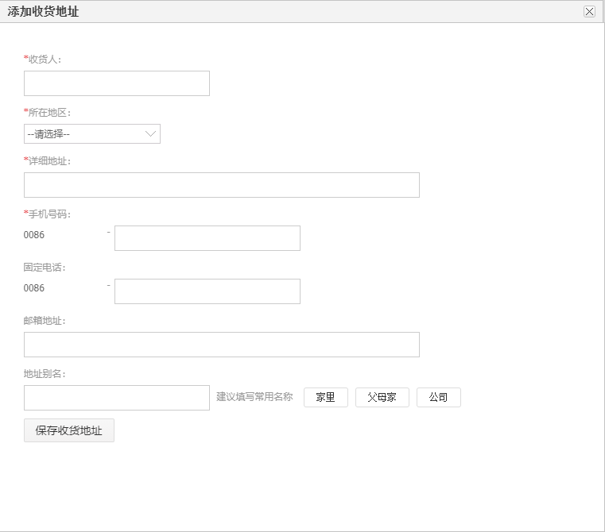

### 2、form 标签

在 HTML 中我们使用 form 标签来定义一个表单。而对于 form 标签来说有两个最重要的属性：action 和 method。

```html
<form action="/aaa/pro01-HTML/page05-form-target.html" method="post"></form>
```

#### action 属性

用户在表单里填写的信息需要发送到服务器端，对于 Java 项目来说就是交给 Java 代码来处理。那么在页面上我们就必须正确填写服务器端的能够接收表单数据的地址。

这个地址要写在 form 标签的 action 属性中。但是现在暂时我们还没有服务器端环境，所以先借用一个 HTML 页面来当作服务器端地址使用。

#### method 属性

『method』这个单词的意思是『方式、方法』，在 form 标签中 method 属性用来定义提交表单的**『请求方式』**。method 属性只有两个可选值：get 或 post，没有极特殊情况的话使用 post 即可。

> 什么是**『请求方式』**？
>
> 浏览器和服务器之间在互相通信时有大量的**『数据』**需要传输。但是不论是浏览器还是服务器都有很多不同厂商提供的不同产品。
>
> 常见的浏览器有：
>
> -   Chrome
> -   Firefox
> -   Safari
> -   Opera
> -   Edge
>
> 常见的 Java 服务器有：
>
> -   Tomcat
> -   Weblogic
> -   WebSphere
> -   Glassfish
> -   Jetty
>
> 这么多不同厂商各自开发的应用程序怎么能保证它们彼此之间传输的**『数据』**能够被对方正确理解呢？
>
> 很简单，我们给这些数据设定**『格式』**，发送端按照格式发送数据，接收端按照格式解析数据，这样就能够实现数据的**『跨平台传输』**了。
>
> 而这里定义的**『数据格式』**就是应用程序之间的**『通信协议』**。
>
> 在 JavaSE 阶段的网络编程章节我们接触过 TCP/IP、UDP 这样的协议，而我们现在使用的**『HTTP 协议』**的底层就是 TCP/IP 协议。
>
> HTTP1.1 中共定义了八种请求方式：
>
> -   GET
> -   POST
> -   PUT
> -   DELETE
> -   HEAD
> -   CONNECT
> -   OPTIONS
> -   TRACE
>
> 但是在 HTML 标签中，点击超链接是 GET 方式的请求，提交一个表单可以通过 form 标签的 method 属性指定 GET 或 POST 请求，其他请求方式无法通过 HTML 标签实现。除了 GET、POST 之外的其他请求方式暂时我们不需要涉及（到我们学习 SpringMVC 时会用到 PUT 和 DELETE）。至于**GET 请求和 POST 请求的区别**我们会在讲 HTTP 协议的时候详细介绍，现在大家可以从表面现象来观察一下。

### 3、name 和 value

在用户使用一个软件系统时，需要一次性提交很多数据是非常正常的现象。我们肯定不能要求用户一个数据一个数据的提交，而肯定是所有数据填好后一起提交。那就带来一个问题，服务器怎么从众多数据中识别出来收货人、所在地区、详细地址、手机号码……？

很简单，**给每个数据都起一个『名字』**，发送数据时用**『名字』**携带对应的数据，接收数据时通过**『名字』**获取对应的数据。

在各个具体的表单标签中，我们通过**『name 属性』**来给数据起**『名字』**，通过**『value 属性』**来保存要发送给服务器的**『值』**。

但是名字和值之间既有可能是**『一个名字对应一个值』**，也有可能是**『一个名字对应多个值』**。

这么看来这样的关系很像我们 Java 中的 Map，而事实上在服务器端就是使用 Map 类型来接收请求参数的。具体的是类型是：**Map<String,String[]>**。

name 属性就是 Map 的键，value 属性就是 Map 的值。

有了上面介绍的基础知识，下面我们就可以来看具体的表单标签了。

### 4、单行文本框

```html
个性签名：
<input type="text" name="signal" />
<br />
```

#### 显示效果

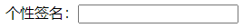

### 5、密码框

#### 代码

```html
密码：
<input type="password" name="secret" />
<br />
```

#### 显示效果

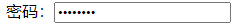

### 6、单选框

#### 代码

```html
你最喜欢的季节是：
<input type="radio" name="season" value="spring" />
春天
<input type="radio" name="season" value="summer" checked="checked" />
夏天
<input type="radio" name="season" value="autumn" />
秋天
<input type="radio" name="season" value="winter" />
冬天

<br />
<br />

你最喜欢的动物是：
<input type="radio" name="animal" value="tiger" />
路虎
<input type="radio" name="animal" value="horse" checked="checked" />
宝马
<input type="radio" name="animal" value="cheetah" />
捷豹
```

#### 效果

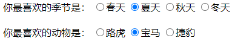

#### 说明

-   name 属性相同的 radio 为一组，组内互斥
-   当用户选择了一个 radio 并提交表单，这个 radio 的 name 属性和 value 属性组成一个键值对发送给服务器
-   设置 checked="checked"属性设置默认被选中的 radio

### 7、多选框

#### 代码

```html
你最喜欢的球队是：
<input type="checkbox" name="team" value="Brazil" />
巴西
<input type="checkbox" name="team" value="German" checked="checked" />
德国
<input type="checkbox" name="team" value="France" />
法国
<input type="checkbox" name="team" value="China" checked="checked" />
中国
<input type="checkbox" name="team" value="Italian" />
意大利
```

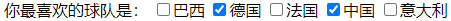

### 8、下拉列表

#### 代码

```html
你喜欢的运动是：
<select name="interesting">
	<option value="swimming">游泳</option>
	<option value="running">跑步</option>
	<option value="shooting" selected="selected">射击</option>
	<option value="skating">溜冰</option>
</select>
```

#### 效果

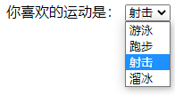

#### 说明

-   下拉列表用到了两种标签，其中 select 标签用来定义下拉列表，而 option 标签设置列表项。
-   name 属性在 select 标签中设置。
-   value 属性在 option 标签中设置。
-   option 标签的标签体是显示出来给用户看的，提交到服务器的是 value 属性的值。
-   通过在 option 标签中设置 selected="selected"属性实现默认选中的效果。

### 9、按钮

#### 代码

```html
<button type="button">普通按钮</button>
<button type="reset">重置按钮</button>
<button type="submit">提交按钮</button>
```

#### 效果

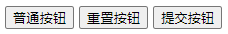

#### 说明

|   类型   |                        功能                        |
| :------: | :------------------------------------------------: |
| 普通按钮 | 点击后无效果，需要通过 JavaScript 绑定单击响应函数 |
| 重置按钮 |      点击后将表单内的所有表单项都恢复为默认值      |
| 提交按钮 |                   点击后提交表单                   |

### 10、表单隐藏域

#### 代码

```html
<input type="hidden" name="userId" value="2233" />
```

#### 说明

通过表单隐藏域设置的表单项不会显示到页面上，用户看不到。但是提交表单时会一起被提交。用来设置一些需要和表单一起提交但是不希望用户看到的数据，例如：用户 id 等等。

### 11、多行文本框

#### 代码

```html
自我介绍：
<textarea name="desc"></textarea>
```

#### 效果

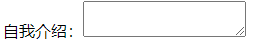

#### 说明

textarea 没有 value 属性，如果要设置默认值需要写在开始和结束标签之间。

## 五、CSS 的简单应用

### 1、设置 CSS 样式的三种方式

#### 在 HTML 标签内设置

仅对当前标签有效

```html
<div style="border: 1px solid black;width: 100px; height: 100px;"></div>
```

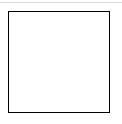

#### 在 head 标签内设置

对当前页面有效

```html
<head>
	<meta charset="UTF-8" />
	<title>Title</title>
	<style type="text/css">
		.one {
			border: 1px solid black;
			width: 100px;
			height: 100px;
			background-color: lightgreen;
			margin-top: 5px;
		}
	</style>
</head>
<body>
	<div style="border: 1px solid black;width: 100px; height: 100px;"></div>

	<div class="one"></div>
	<div class="one"></div>
	<div class="one"></div>
</body>
```

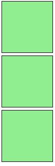

#### 引入外部 CSS 样式文件

##### 创建 CSS 文件

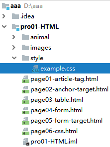

##### 编辑 CSS 文件

```css
.two {
	border: 1px solid black;
	width: 100px;
	height: 100px;
	background-color: yellow;
	margin-top: 5px;
}
```

##### 引入外部 CSS 文件

在需要使用这个 CSS 文件的 HTML 页面的 head 标签内加入：

```html
<link rel="stylesheet" type="text/css" href="/aaa/pro01-HTML/style/example.css" />
```

于是下面 HTML 代码的显示效果是：

```html
<div class="two"></div>
<div class="two"></div>
<div class="two"></div>
```

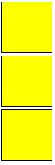

### 2、CSS 代码语法

-   CSS 样式由选择器和声明组成，而声明又由属性和值组成。
-   属性和值之间用冒号隔开。
-   多条声明之间用分号隔开。
-   使用/_..._/声明注释。

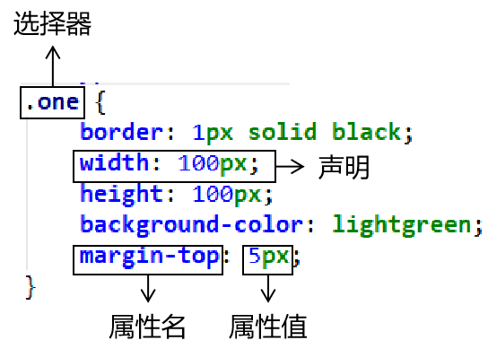

### 3、CSS 选择器

#### 标签选择器

HTML 代码：

```css
<p>Hello, this is a p tag.</p>
<p>Hello, this is a p tag.</p>
<p>Hello, this is a p tag.</p>
<p>Hello, this is a p tag.</p>
<p>Hello, this is a p tag.</p>
```

CSS 代码：

```css
p {
	color: blue;
	font-weight: bold;
}
```

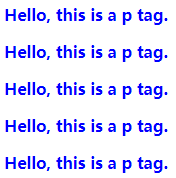

#### id 选择器

HTML 代码：

```html
<p>Hello, this is a p tag.</p>
<p>Hello, this is a p tag.</p>
<p id="special">Hello, this is a p tag.</p>
<p>Hello, this is a p tag.</p>
<p>Hello, this is a p tag.</p>
```

CSS 代码：

```css
#special {
	font-size: 20px;
	background-color: aqua;
}
```

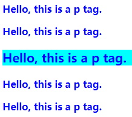

#### 类选择器

HTML 代码：

```html
<div class="one"></div>
<div class="one"></div>
<div class="one"></div>
```

CSS 代码：

```css
.one {
	border: 1px solid black;
	width: 100px;
	height: 100px;
	background-color: lightgreen;
	margin-top: 5px;
}
```


### 4、定位与浮动

这里不做太多的简介！

简单来说定位与浮动的关系：

-   relative：定位相对于 float 进行调试！
-   absoulte：定位与 top、left 进行调试！
