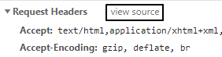
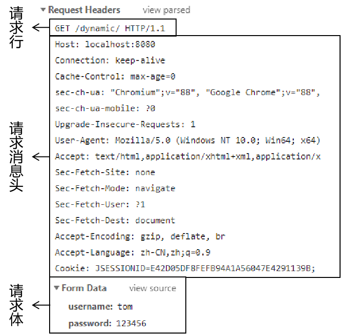
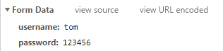
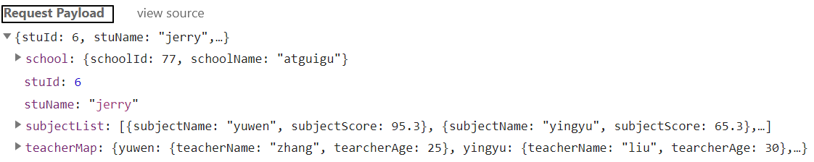
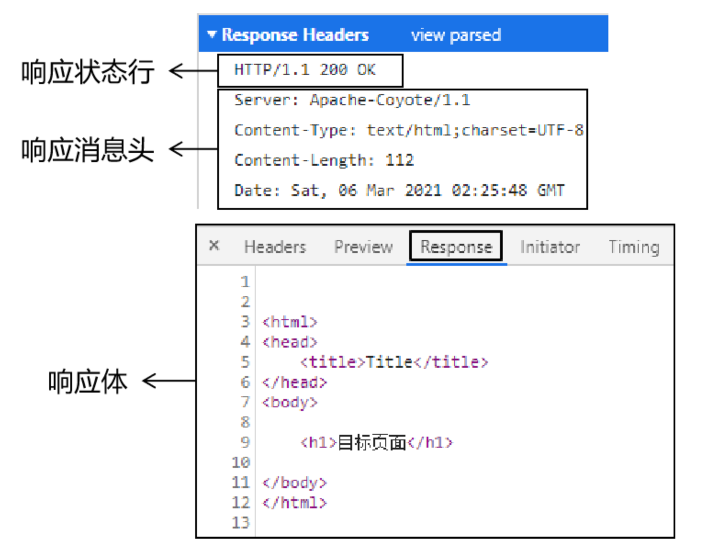

---
# 当前页面内容标题
title: 09、HTTP协议
# 分类
category:
    - web
    - javaweb
    - java
# 标签
tag:
    - java
    - web
    - HTTP
sticky: true
# 是否收藏在博客主题的文章列表中，当填入数字时，数字越大，排名越靠前。
star: false
# 是否将该文章添加至文章列表中
article: true
# 是否将该文章添加至时间线中
timeline: true
---

# 09、HTTP 协议

## 1、介绍

HTTP：**H**yper **T**ext **T**ransfer **P**rotocol 超文本传输协议。HTTP 最大的作用就是确定了请求和响应数据的格式。浏览器发送给服务器的数据：请求报文；服务器返回给浏览器的数据：响应报文。

## 2、请求报文

### 在开发者工具中浏览报文源码



### 请求报文的三个部分



### 请求行

作用：展示当前请求的最基本信息

> POST /dynamic/target.jsp HTTP/1.1

-   请求方式
-   访问地址
-   HTTP 协议的版本

### 请求消息头

作用：通过具体的参数对本次请求进行详细的说明

格式：键值对，键和值之间使用冒号隔开

相对比较重要的请求消息头：

| 名称           | 功能                                                 |
| -------------- | ---------------------------------------------------- |
| Host           | 服务器的主机地址                                     |
| Accept         | 声明当前请求能够接受的『媒体类型』                   |
| Referer        | 当前请求来源页面的地址                               |
| Content-Length | 请求体内容的长度                                     |
| Content-Type   | 请求体的内容类型，这一项的具体值是媒体类型中的某一种 |
| Cookie         | 浏览器访问服务器时携带的 Cookie 数据                 |

### 请求体

作用：作为请求的主体，发送数据给服务器。具体来说其实就是 POST 请求方式下的请求参数。

格式：

#### form data

含义：当前请求体是一个表单提交的请求参数。



查看源码后，发现格式如下：

> username=tom&password=123456

-   每一组请求参数是一个键值对
-   键和值中间是等号
-   键值对之间是&号

#### Request Payload

含义：整个请求体以某种特定格式来组织数据，例如 JSON 格式。



## 3、请求方式

### HTTP 协议已定义的请求方式

HTTP1.1 中共定义了八种请求方式：

-   **GET**：从服务器端获取数据
-   **POST**：将数据保存到服务器端
-   **PUT**：命令服务器对数据执行更新
-   **DELETE**：命令服务器删除数据
-   HEAD
-   CONNECT
-   OPTIONS
-   TRACE

### GET 请求

-   特征 1：没有请求体
-   特征 2：请求参数附着在 URL 地址后面
-   特征 3：请求参数在浏览器地址栏能够直接被看到，存在安全隐患
-   特征 4：在 URL 地址后面携带请求参数，数据容量非常有限。如果数据量大，那么超出容量的数据会丢失
-   特征 5：从报文角度分析，请求参数是在请求行中携带的，因为访问地址在请求行

### POST 请求

-   特征 1：有请求体
-   特征 2：请求参数放在请求体中
-   特征 3：请求体发送数据的空间没有限制
-   特征 4：可以发送各种不同类型的数据
-   特征 5：从报文角度分析，请求参数是在请求体中携带的
-   特征 6：由于请求参数是放在请求体中，所以浏览器地址栏看不到

## 4、媒体类型

### HTTP 协议中的 MIME 类型

Multipurpose Internet Mail Extensions

### 用途

为了让用户通过浏览器和服务器端交互的过程中有更好、更丰富的体验，HTTP 协议需要支持丰富的数据类型。

### MIME 类型定义参考

我们可以通过查看 Tomcat 解压目录下 conf/web.xml 配置文件，了解 HTTP 协议中定义的 MIME 类型。

```xml
<mime-mapping>
    <extension>mp4</extension>
    <mime-type>video/mp4</mime-type>
</mime-mapping>
<mime-mapping>
    <extension>doc</extension>
    <mime-type>application/msword</mime-type>
</mime-mapping>
<mime-mapping>
    <extension>json</extension>
    <mime-type>application/json</mime-type>
</mime-mapping>
<mime-mapping>
    <extension>html</extension>
    <mime-type>text/html</mime-type>
</mime-mapping>
```

从上面的例子中可以看出：MIME 的基本格式是

> 大类/具体类型

MIME 类型在 HTTP 报文中对应的是内容类型：Content-type

## 5、响应报文



### 响应状态行

> HTTP/1.1 200 OK

-   HTTP 协议版本
-   **响应状态码**
-   响应状态的说明文字

### 响应消息头

-   响应体的说明书。
-   服务器端对浏览器端设置数据，例如：服务器端返回 Cookie 信息。

| 名称           | 功能                                                 |
| -------------- | ---------------------------------------------------- |
| Content-Type   | 响应体的内容类型                                     |
| Content-Length | 响应体的内容长度                                     |
| Set-Cookie     | 服务器返回新的 Cookie 信息给浏览器                   |
| location       | 在**重定向**的情况下，告诉浏览器访问下一个资源的地址 |

### 响应体

服务器返回的数据主体，有可能是各种数据类型。

-   HTML 页面
-   图片
-   视频
-   以下载形式返回的文件
-   CSS 文件
-   JavaScript 文件

### 响应状态码

作用：以编码的形式告诉浏览器当前请求处理的结果

| 状态码 | 含义                                                       |
| ------ | ---------------------------------------------------------- |
| 200    | 服务器成功处理了当前请求，成功返回响应                     |
| 302    | 重定向                                                     |
| 400    | [SpringMVC 特定环境]请求参数问题                           |
| 403    | 没有权限                                                   |
| 404    | 找不到目标资源                                             |
| 405    | 请求方式和服务器端对应的处理方式不一致                     |
| 406    | [SpringMVC 特定环境]请求扩展名和实际返回的响应体类型不一致 |
| 50X    | 服务器端内部错误，通常都是服务器端抛异常了                 |

404 产生的具体原因：

-   访问地址写错了，确实是没有这个资源
-   访问了 WEB-INF 目录下的资源
-   Web 应用启动的时候，控制台已经抛出异常，导致整个 Web 应用不可用，访问任何资源都是 404
-   服务器端缓存
