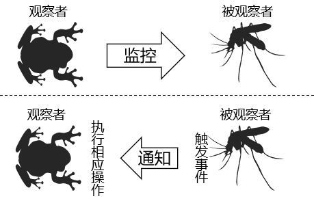
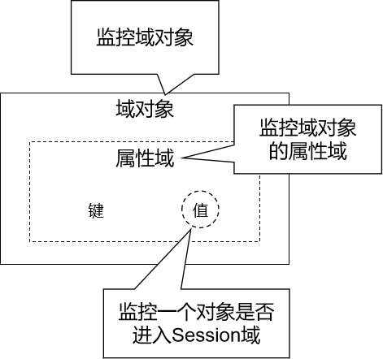

---
# 当前页面内容标题
title: 18、Listener 监听器
# 分类
category:
    - javaweb
    - java
    - listener
# 标签
tag:
    - javaweb
    - java
    - listener
sticky: true
# 是否收藏在博客主题的文章列表中，当填入数字时，数字越大，排名越靠前。
star: false
# 是否将该文章添加至文章列表中
article: true
# 是否将该文章添加至时间线中
timeline: true
---

# 18、Listener 监听器

## 一、观察者模式

二十三种设计模式之一：



-   观察者：监控『被观察者』的行为，一旦发现『被观察者』触发了事件，就会调用事先准备好的方法执行操作。
-   被观察者：『被观察者』一旦触发了被监控的事件，就会被『观察者』发现。

## 二、监听器简介

### 1、概念

监听器：专门用于对其他对象身上发生的事件或状态改变进行监听和相应处理的对象，当被监视的对象发生情况时，立即采取相应的行动。 **Servlet 监听器**：Servlet 规范中定义的一种特殊类，它用于监听 Web 应用程序中的 ServletContext，HttpSession 和 HttpServletRequest 等域对象的创建与销毁事件，以及监听这些域对象中的属性发生修改的事件。

### 2、分类



-   域对象监听器
-   域对象的属性域监听器
-   Session 域中数据的监听器

### 3、监听器列表

#### ①ServletContextListener

作用：监听 ServletContext 对象的创建与销毁

| 方法名                                      | 作用                      |
| ------------------------------------------- | ------------------------- |
| contextInitialized(ServletContextEvent sce) | ServletContext 创建时调用 |
| contextDestroyed(ServletContextEvent sce)   | ServletContext 销毁时调用 |

ServletContextEvent 对象代表从 ServletContext 对象身上捕获到的事件，通过这个事件对象我们可以获取到 ServletContext 对象。

#### ②HttpSessionListener

作用：监听 HttpSession 对象的创建与销毁

| 方法名                                 | 作用                       |
| -------------------------------------- | -------------------------- |
| sessionCreated(HttpSessionEvent hse)   | HttpSession 对象创建时调用 |
| sessionDestroyed(HttpSessionEvent hse) | HttpSession 对象销毁时调用 |

HttpSessionEvent 对象代表从 HttpSession 对象身上捕获到的事件，通过这个事件对象我们可以获取到触发事件的 HttpSession 对象。

#### ③ServletRequestListener

作用：监听 ServletRequest 对象的创建与销毁

| 方法名                                      | 作用                          |
| ------------------------------------------- | ----------------------------- |
| requestInitialized(ServletRequestEvent sre) | ServletRequest 对象创建时调用 |
| requestDestroyed(ServletRequestEvent sre)   | ServletRequest 对象销毁时调用 |

ServletRequestEvent 对象代表从 HttpServletRequest 对象身上捕获到的事件，通过这个事件对象我们可以获取到触发事件的 HttpServletRequest 对象。另外还有一个方法可以获取到当前 Web 应用的 ServletContext 对象。

#### ④ServletContextAttributeListener

作用：监听 ServletContext 中属性的创建、修改和销毁

| 方法名                                               | 作用                                   |
| ---------------------------------------------------- | -------------------------------------- |
| attributeAdded(ServletContextAttributeEvent scab)    | 向 ServletContext 中添加属性时调用     |
| attributeRemoved(ServletContextAttributeEvent scab)  | 从 ServletContext 中移除属性时调用     |
| attributeReplaced(ServletContextAttributeEvent scab) | 当 ServletContext 中的属性被修改时调用 |

ServletContextAttributeEvent 对象代表属性变化事件，它包含的方法如下：

| 方法名              | 作用                     |
| ------------------- | ------------------------ |
| getName()           | 获取修改或添加的属性名   |
| getValue()          | 获取被修改或添加的属性值 |
| getServletContext() | 获取 ServletContext 对象 |

#### ⑤HttpSessionAttributeListener

作用：监听 HttpSession 中属性的创建、修改和销毁

| 方法名                                        | 作用                                |
| --------------------------------------------- | ----------------------------------- |
| attributeAdded(HttpSessionBindingEvent se)    | 向 HttpSession 中添加属性时调用     |
| attributeRemoved(HttpSessionBindingEvent se)  | 从 HttpSession 中移除属性时调用     |
| attributeReplaced(HttpSessionBindingEvent se) | 当 HttpSession 中的属性被修改时调用 |

HttpSessionBindingEvent 对象代表属性变化事件，它包含的方法如下：

| 方法名       | 作用                            |
| ------------ | ------------------------------- |
| getName()    | 获取修改或添加的属性名          |
| getValue()   | 获取被修改或添加的属性值        |
| getSession() | 获取触发事件的 HttpSession 对象 |

#### ⑥ServletRequestAttributeListener

作用：监听 ServletRequest 中属性的创建、修改和销毁

| 方法名                                               | 作用                                   |
| ---------------------------------------------------- | -------------------------------------- |
| attributeAdded(ServletRequestAttributeEvent srae)    | 向 ServletRequest 中添加属性时调用     |
| attributeRemoved(ServletRequestAttributeEvent srae)  | 从 ServletRequest 中移除属性时调用     |
| attributeReplaced(ServletRequestAttributeEvent srae) | 当 ServletRequest 中的属性被修改时调用 |

ServletRequestAttributeEvent 对象代表属性变化事件，它包含的方法如下：

| 方法名               | 作用                               |
| -------------------- | ---------------------------------- |
| getName()            | 获取修改或添加的属性名             |
| getValue()           | 获取被修改或添加的属性值           |
| getServletRequest () | 获取触发事件的 ServletRequest 对象 |

#### ⑦HttpSessionBindingListener

作用：监听某个对象在 Session 域中的创建与移除

| 方法名                                      | 作用                                |
| ------------------------------------------- | ----------------------------------- |
| valueBound(HttpSessionBindingEvent event)   | 该类的实例被放到 Session 域中时调用 |
| valueUnbound(HttpSessionBindingEvent event) | 该类的实例从 Session 中移除时调用   |

HttpSessionBindingEvent 对象代表属性变化事件，它包含的方法如下：

| 方法名       | 作用                            |
| ------------ | ------------------------------- |
| getName()    | 获取当前事件涉及的属性名        |
| getValue()   | 获取当前事件涉及的属性值        |
| getSession() | 获取触发事件的 HttpSession 对象 |

#### ⑧HttpSessionActivationListener

作用：监听某个对象在 Session 中的序列化与反序列化。

| 方法名                                    | 作用                                    |
| ----------------------------------------- | --------------------------------------- |
| sessionWillPassivate(HttpSessionEvent se) | 该类实例和 Session 一起钝化到硬盘时调用 |
| sessionDidActivate(HttpSessionEvent se)   | 该类实例和 Session 一起活化到内存时调用 |

HttpSessionEvent 对象代表事件对象，通过 getSession()方法获取事件涉及的 HttpSession 对象。

## 三、ServletContextListener

### 1、实用性

将来学习 SpringMVC 的时候，会用到一个 ContextLoaderListener，这个监听器就实现了 ServletContextListener 接口，表示对 ServletContext 对象本身的生命周期进行监控。

### 2、具体用法

#### ① 创建监听器类

```java
public class AtguiguListener implements ServletContextListener {
    @Override
    public void contextInitialized(
            // Event对象代表本次事件，通过这个对象可以获取ServletContext对象本身
            ServletContextEvent sce) {
        System.out.println("Hello，我是ServletContext，我出生了！");

        ServletContext servletContext = sce.getServletContext();
        System.out.println("servletContext = " + servletContext);
    }

    @Override
    public void contextDestroyed(ServletContextEvent sce) {
        System.out.println("Hello，我是ServletContext，我打算去休息一会儿！");
    }
}
```

#### ② 注册监听器

```xml
<!-- 每一个listener标签对应一个监听器配置，若有多个监听器，则配置多个listener标签即可 -->
<listener>
    <!-- 配置监听器指定全类名即可 -->
    <listener-class>com.atguigu.listener.AtguiguListener</listener-class>
</listener>
```

事件触发过程中控制台日志的打印：

> Connected to server [2021-03-20 04:23:20,982] Artifact pro10-listener:war exploded: Artifact is being deployed, please wait... 三月 20, 2021 4:23:21 下午 org.apache.catalina.deploy.WebXml setVersion 警告: Unknown version string [4.0]. Default version will be used. Hello，我是 ServletContext，我出生了！ servletContext = org.apache.catalina.core.ApplicationContextFacade@6a66017e [2021-03-20 04:23:21,426] Artifact pro10-listener:war exploded: Artifact is deployed successfully [2021-03-20 04:23:21,426] Artifact pro10-listener:war exploded: Deploy took 444 milliseconds 三月 20, 2021 4:23:30 下午 org.apache.catalina.startup.HostConfig deployDirectory 信息: Deploying web application directory D:\software\apache-tomcat-7.0.57\webapps\manager 三月 20, 2021 4:23:31 下午 org.apache.catalina.startup.HostConfig deployDirectory 信息: Deployment of web application directory D:\software\apache-tomcat-7.0.57\webapps\manager has finished in 124 ms [2021-03-20 04:24:06,422] Artifact pro10-listener:war exploded: Artifact is being deployed, please wait... Hello，我是 ServletContext，我打算去休息一会儿！ Hello，我是 ServletContext，我出生了！ servletContext = org.apache.catalina.core.ApplicationContextFacade@2a55374c [2021-03-20 04:24:07,115] Artifact pro10-listener:war exploded: Artifact is deployed successfully [2021-03-20 04:24:07,115] Artifact pro10-listener:war exploded: Deploy took 694 milliseconds
