---
# 当前页面内容标题
title: 19、Axios Ajax
# 分类
category:
    - axios
    - ajax
# 标签
tag:
    - axios
    - ajax
sticky: true
# 是否收藏在博客主题的文章列表中，当填入数字时，数字越大，排名越靠前。
star: false
# 是否将该文章添加至文章列表中
article: true
# 是否将该文章添加至时间线中
timeline: true
---

# 19、Axios Ajax

## 一、Ajax 概述

### 1、服务器端渲染

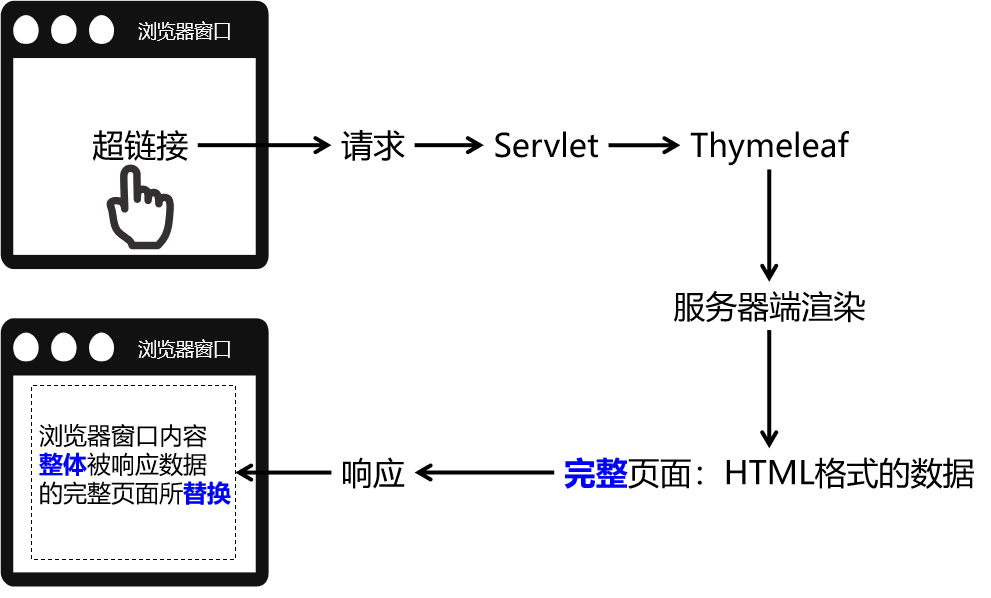

### 2、Ajax 渲染（局部更新）

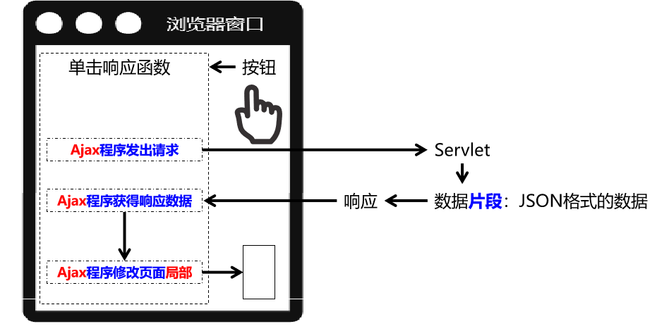

### 3、前后端分离

彻底舍弃服务器端渲染，数据全部通过 Ajax 方式以 JSON 格式来传递。

### 4、同步与异步

Ajax 本身就是 Asynchronous JavaScript And XML 的缩写，直译为：异步的 JavaScript 和 XML。在实际应用中 Ajax 指的是：**不刷新浏览器窗口**，**不做页面跳转**，**局部更新页面内容**的技术。

**『同步』**和**『异步』**是一对相对的概念，那么什么是同步，什么是异步呢？

#### ① 同步

多个操作**按顺序执行**，前面的操作没有完成，后面的操作就必须**等待**。所以同步操作通常是**串行**的。

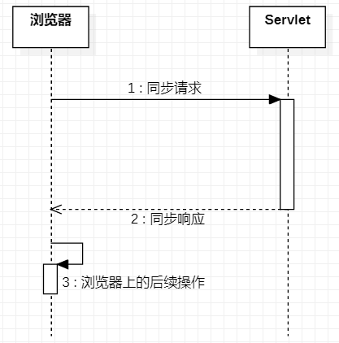

#### ② 异步

多个操作相继开始**并发执行**，即使开始的先后顺序不同，但是由于它们各自是**在自己独立的进程或线程中**完成，所以**互不干扰**，**谁也\*\*不用等\*\*谁**。

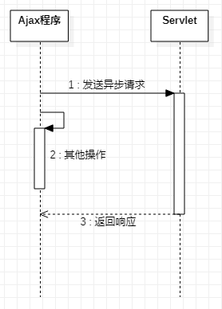

### 5、Axios 简介

使用原生的 JavaScript 程序执行 Ajax 极其繁琐，所以一定要使用框架来完成。而 Axios 就是目前最流行的前端 Ajax 框架。

> Axios 官网：<http://www.axios-js.com/>

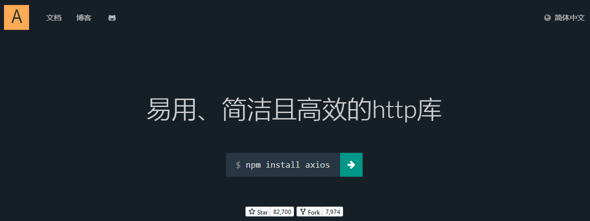

使用 Axios 和使用 Vue 一样，导入对应的\*.js 文件即可。官方提供的 script 标签引入方式为：

```html
<script src="https://unpkg.com/axios/dist/axios.min.js"></script>
```

我们可以把这个 axios.min.js 文件下载下来保存到本地来使用。

## 二、 Axios 基本用法

### 0、在前端页面引入开发环境

```html
<script type="text/javascript" src="/demo/static/vue.js"></script>
<script type="text/javascript" src="/demo/static/axios.min.js"></script>
```

### 1、发送普通请求参数

### ① 前端代码

HTML 标签：

```javascript
    <div id="app">
        <button @click="commonParam">普通请求参数</button>
    </div>
```

Vue+axios 代码：

```javascript
new Vue({
	el: '#app',
	data: {},
	methods: {
		commonParam: function () {
			axios({
				method: 'post',
				url: '/demo/AjaxServlet?method=commonParam',
				params: {
					userName: 'tom',
					userPwd: '123456',
				},
			})
				.then(function (response) {
					console.log(response);
				})
				.catch(function (error) {
					console.log(error);
				});
		},
	},
});
```

效果：所有请求参数都被放到 URL 地址后面了，哪怕我们现在用的是 POST 请求方式。

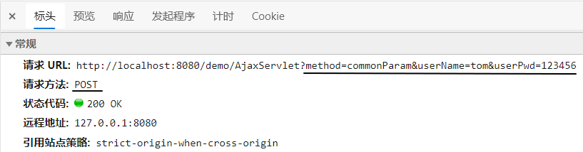

#### ② 后端代码

```java
public class AjaxServlet extends ModelBaseServlet {
    protected void commonParam(HttpServletRequest request, HttpServletResponse response) throws ServletException, IOException {

        String userName = request.getParameter("userName");
        String userPwd = request.getParameter("userPwd");

        System.out.println("userName = " + userName);
        System.out.println("userPwd = " + userPwd);

        response.setContentType("text/html;charset=UTF-8");
        response.getWriter().write("服务器端返回普通文本字符串作为响应");

    }
}
```

> P.S.：由于我们不需要 Thymeleaf 了，所以 ModelBaseServlet 可以跳过 ViewBaseServlet 直接继承 HttpServlet。

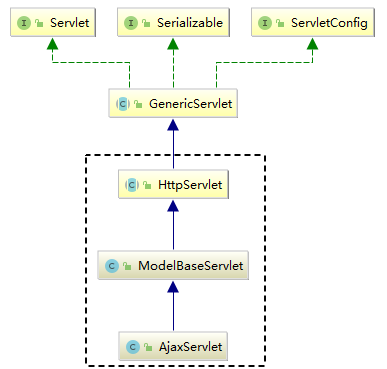

#### ③axios 程序接收到的响应对象结构

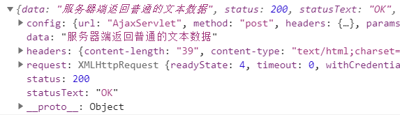

| 属性名     | 作用                                                  |
| ---------- | ----------------------------------------------------- |
| config     | 调用 axios(config 对象)方法时传入的 JSON 对象         |
| data       | 服务器端返回的响应体数据                              |
| headers    | 响应消息头                                            |
| request    | 原生 JavaScript 执行 Ajax 操作时使用的 XMLHttpRequest |
| status     | 响应状态码                                            |
| statusText | 响应状态码的说明文本                                  |

#### ④ 服务器端处理请求失败后

```javascript
catch(function (error) {     // catch()服务器端处理请求出错后，会调用

    console.log(error);         // error就是出错时服务器端返回的响应数据
    console.log(error.response);        // 在服务器端处理请求失败后，获取axios封装的JSON格式的响应数据对象
    console.log(error.response.status); // 在服务器端处理请求失败后，获取响应状态码
    console.log(error.response.statusText); // 在服务器端处理请求失败后，获取响应状态说明文本
    console.log(error.response.data);   // 在服务器端处理请求失败后，获取响应体数据

});
```

在给 catch()函数传入的回调函数中，error 对象封装了服务器端处理请求失败后相应的错误信息。其中，axios 封装的响应数据对象，是 error 对象的 response 属性。response 属性对象的结构如下图所示：

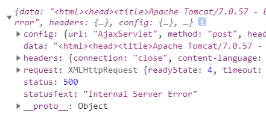

可以看到，response 对象的结构还是和 then()函数传入的回调函数中的 response 是一样的：

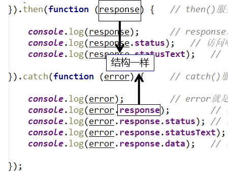

> 回调函数：开发人员声明，但是调用时交给系统来调用。像单击响应函数、then()、catch()里面传入的都是回调函数。回调函数是相对于普通函数来说的，普通函数就是开发人员自己声明，自己调用：

```javascript
function sum(a, b) {
	return a + b;
}

var result = sum(3, 2);
console.log('result=' + result);
```

### 2、发送请求体 JSON

#### ① 前端代码

HTML 代码：

```html
<button @click="requestBodyJSON">请求体JSON</button>
```

Vue+axios 代码：

```javascript
……
"methods":{
    "requestBodyJSON":function () {
        axios({
            "method":"post",
            "url":"/demo/AjaxServlet?method=requestBodyJSON",
            "data":{
                "stuId": 55,
                "stuName": "tom",
                "subjectList": [
                    {
                        "subjectName": "java",
                        "subjectScore": 50.55
                    },
                    {
                        "subjectName": "php",
                        "subjectScore": 30.26
                    }
                ],
                "teacherMap": {
                    "one": {
                        "teacherName":"tom",
                        "tearcherAge":23
                    },
                    "two": {
                        "teacherName":"jerry",
                        "tearcherAge":31
                    },
                },
                "school": {
                    "schoolId": 23,
                    "schoolName": "atguigu"
                }
            }
        }).then(function (response) {
            console.log(response);
        }).catch(function (error) {
            console.log(error);
        });
    }
}
……
```

效果：

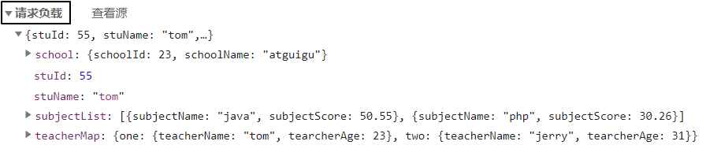

> P.S.：Chrome 浏览器中将『请求负载』显示为英文：『Request Payload』。

#### ② 后端代码

##### [1]加入 Gson 包

Gson 是 Google 研发的一款非常优秀的**JSON 数据解析和生成工具**，它可以帮助我们将数据在 JSON 字符串和 Java 对象之间互相转换。

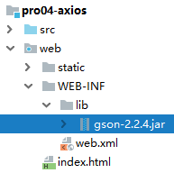

##### [2]Servlet 代码

```java
protected void requestBodyJSON(HttpServletRequest request, HttpServletResponse response) throws ServletException, IOException {

    // 1.由于请求体数据有可能很大，所以Servlet标准在设计API的时候要求我们通过输入流来读取
    BufferedReader reader = request.getReader();

    // 2.创建StringBuilder对象来累加存储从请求体中读取到的每一行
    StringBuilder builder = new StringBuilder();

    // 3.声明临时变量
    String bufferStr = null;

    // 4.循环读取
    while((bufferStr = reader.readLine()) != null) {
        builder.append(bufferStr);
    }

    // 5.关闭流
    reader.close();

    // 6.累加的结果就是整个请求体
    String requestBody = builder.toString();

    // 7.创建Gson对象用于解析JSON字符串
    Gson gson = new Gson();

    // 8.将JSON字符串还原为Java对象
    Student student = gson.fromJson(requestBody, Student.class);
    System.out.println("student = " + student);

    System.out.println("requestBody = " + requestBody);

    response.setContentType("text/html;charset=UTF-8");
    response.getWriter().write("服务器端返回普通文本字符串作为响应");
}
```

> P.S.：看着很麻烦是吧？别担心，将来我们有了**SpringMVC**之后，一个**@RequestBody**注解就能够搞定，非常方便！

### 3、服务器端返回 JSON 数据

#### ① 前端代码

```javascript
axios({
	method: 'post',
	url: '/demo/AjaxServlet?method=responseBodyJSON',
})
	.then(function (response) {
		console.log(response);
	})
	.catch(function (error) {
		console.log(error);
	});
```

then()中获取到的 response 在控制台打印效果如下：我们需要通过 data 属性获取响应体数据

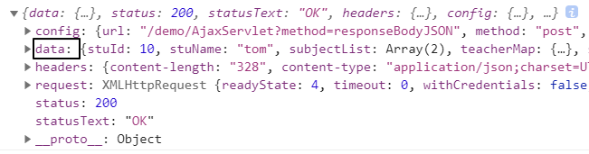

#### ② 后端代码

##### [1]加入 Gson 包

仍然需要 Gson 支持，不用多说


##### [2]Servlet 代码

```java
protected void responseBodyJSON(HttpServletRequest request, HttpServletResponse response) throws ServletException, IOException {

    // 1.准备数据对象
    Student student = new Student();
    student.setStuId(10);
    student.setStuName("tom");
    student.setSchool(new School(11,"atguigu"));
    student.setSubjectList(Arrays.asList(new Subject("java", 95.5), new Subject("php", 93.3)));

    Map<String, Teacher> teacherMap = new HashMap<>();
    teacherMap.put("t1", new Teacher("lili", 25));
    teacherMap.put("t2", new Teacher("mary", 26));
    teacherMap.put("t3", new Teacher("katty", 27));

    student.setTeacherMap(teacherMap);

    // 2.创建Gson对象
    Gson gson = new Gson();

    // 3.将Java对象转换为JSON对象
    String json = gson.toJson(student);

    // 4.设置响应体的内容类型
    response.setContentType("application/json;charset=UTF-8");
    response.getWriter().write(json);

}
```
