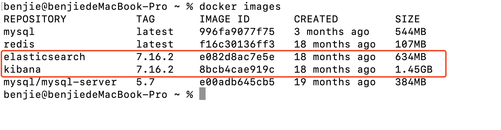
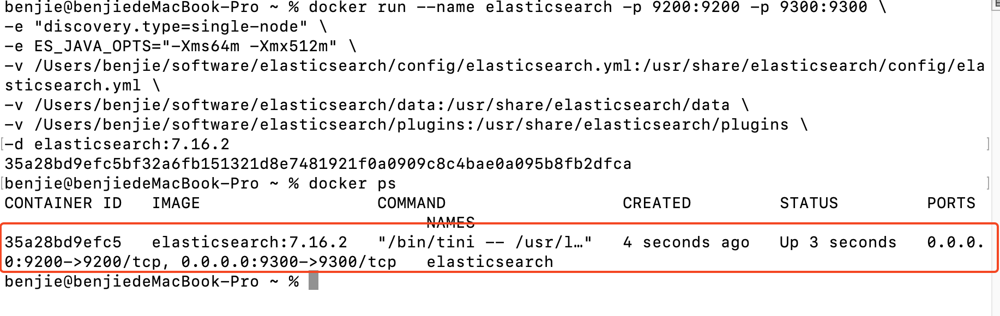
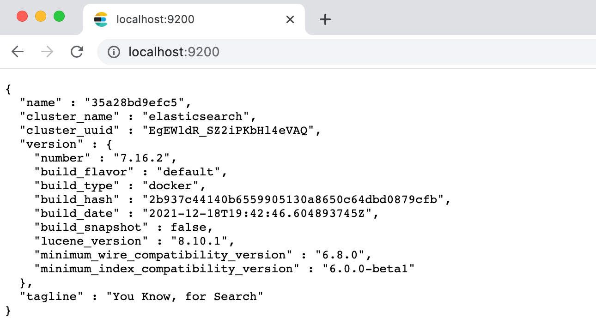
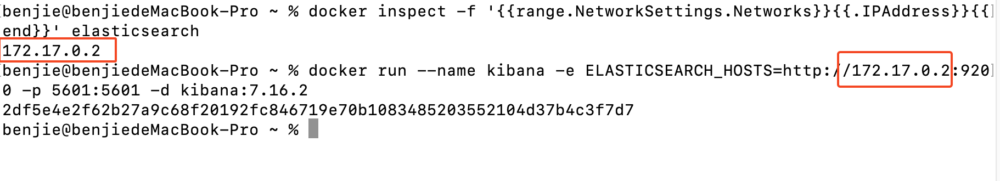

# 3 分钟完成 Macbook m1 芯片使用 docker 安装 Elasticsearch 和 Kibana

## 1、下载镜像文件

elasticsearch：存储和检索数据；

kibana：可视化检索数据

```shell
docker pull elasticsearch:7.16.2 docker pull kibana:7.16.2
```



## 2、创建 es 实例

### 2.1、本地创建 3 个文件夹 config/data/plugins，并修改权限，用作映射

```shell
mkdir software/elasticsearch/config mkdir software/elasticsearch/data mkdir software/elasticsearch/plugins echo "http.host: 0.0.0.0" >> software/elasticsearch/config/elasticsearch.yml chmod -R 777 software/elasticsearch/
```

### 2.2、启动 es

```shell
docker run --name elasticsearch -p 9200:9200 -p 9300:9300 \ -e "discovery.type=single-node" \ -e ES_JAVA_OPTS="-Xms64m -Xmx512m" \ -v /Users/benjie/software/elasticsearch/config/elasticsearch.yml:/usr/share/elasticsearch/config/elasticsearch.yml \ -v /Users/benjie/software/elasticsearch/data:/usr/share/elasticsearch/data \ -v /Users/benjie/software/elasticsearch/plugins:/usr/share/elasticsearch/plugins \ -d elasticsearch:7.16.2
```

解释：

> \-e ES_JAVA_OPTS="-Xms64m -Xmx512m" \\ 设置 ES 的初始内存和最大内存，否则导致过大启动不了 ES



### 2.3、验证访问`http://localhost:9200`：



## 3、创建 Kibana

### 3.1 查询 elasticsearch 中的内部 ip，查询命令：

```shell
docker inspect -f '{{range.NetworkSettings.Networks}}{{.IPAddress}}{{end}}' elasticsearch
```

### 3.2、启动 kibana

```shell
docker run --name kibana -e ELASTICSEARCH_HOSTS=http://172.17.0.2:9200 -p 5601:5601 -d kibana:7.16.2
```

> \-e ELASTICSEARCH_HOSTS= [http://172.17.0.2:9200](http://172.17.0.2:9200/) 一定要先查询到内部 ip，替换



### 3.3、验证访问`http://localhost:5601`


