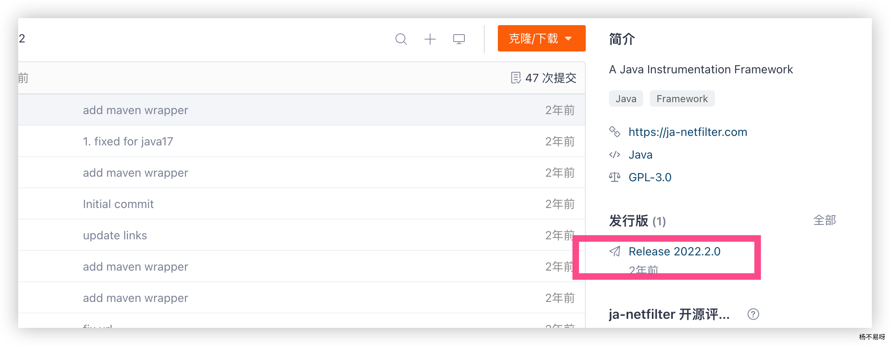
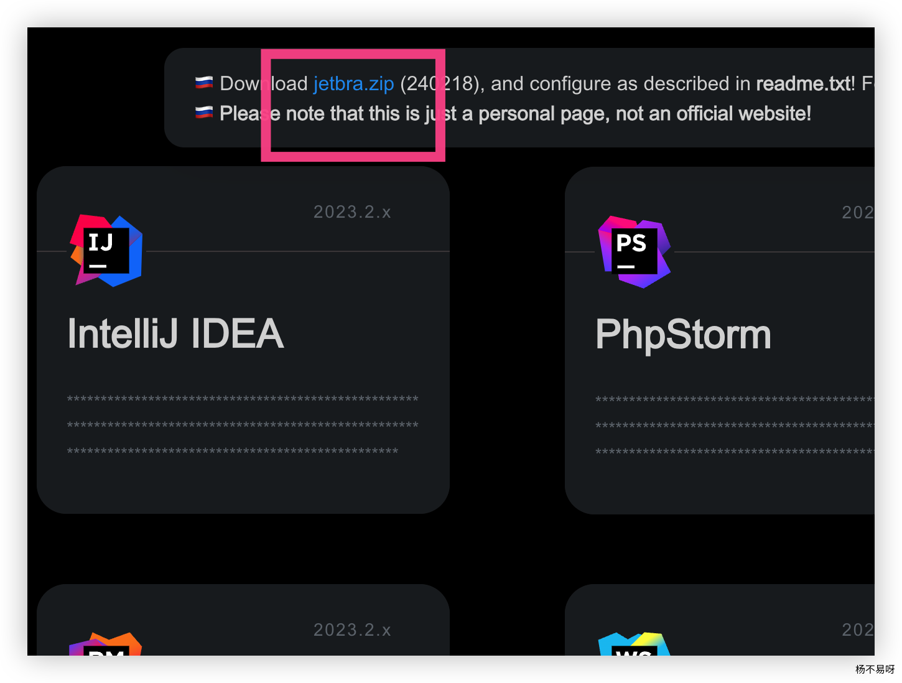
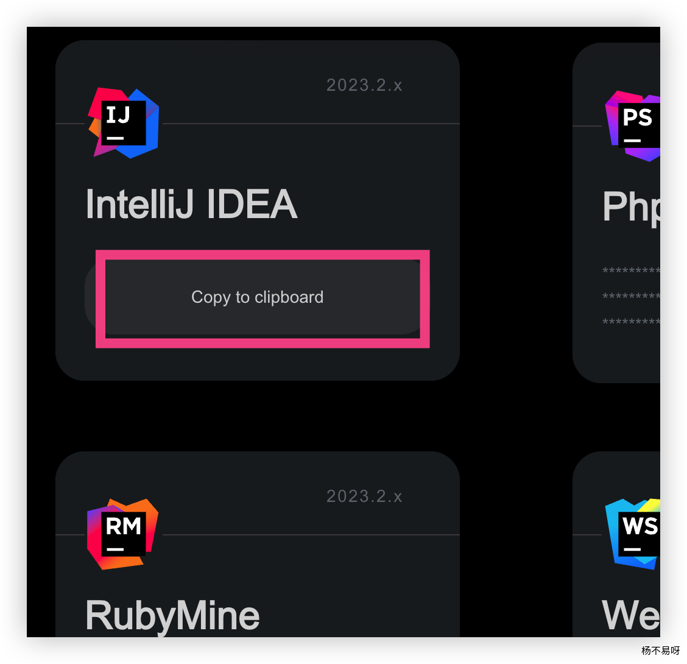
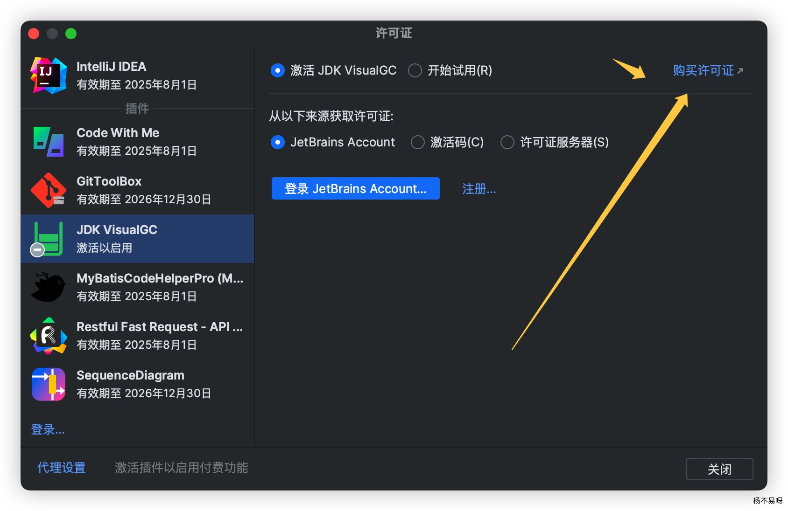
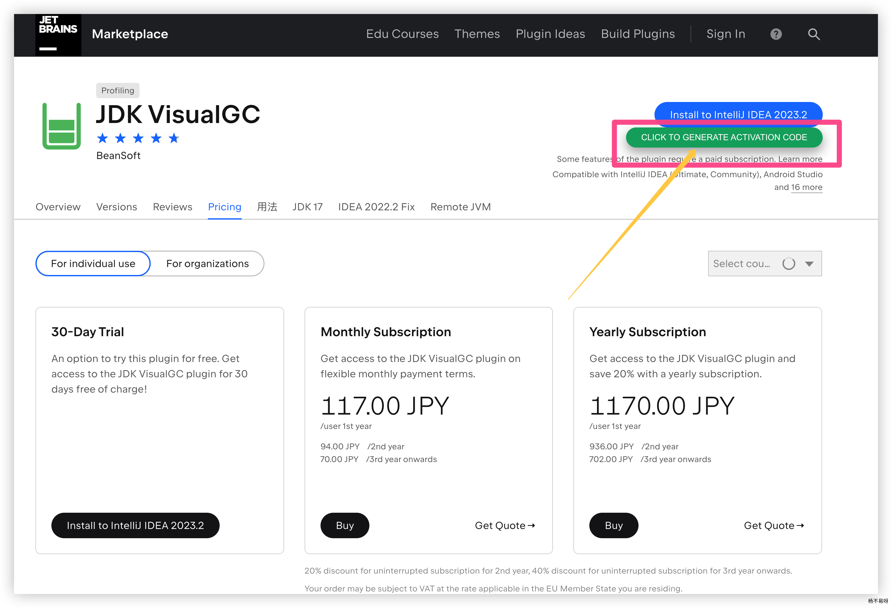
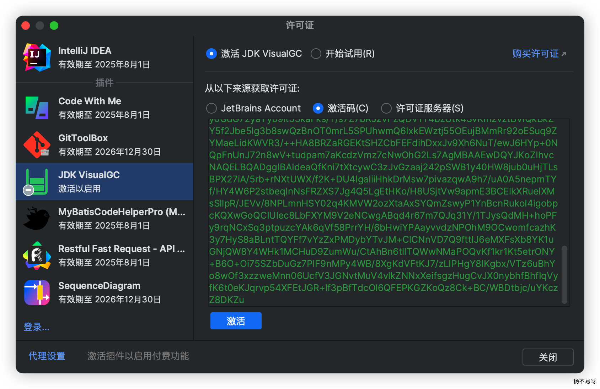

---
# 当前页面内容标题
title: ja-netfilte激活jetbra全家桶包括插件统统激活
# 分类
category:
    - idea
    - 插件激活破解
    - idea破解
# 标签
tag:
    - 插件激活
    - idea
    - 插件激活
sticky: false
# 是否收藏在博客主题的文章列表中，当填入数字时，数字越大，排名越靠前。
star: false
# 是否将该文章添加至文章列表中
article: true
# 是否将该文章添加至时间线中
timeline: true
---

## 1.下载 ja-netfilter jar 包

https://gitee.com/ja-netfilter/ja-netfilter



## 2.下载 jetbra 包,随便点击一个网站

> https://3.jetbra.in/



> 将下载的 jetbra.zip 解压，找到 config-jetbrains 文件夹里面的文件全部复制到， ja-netfilter config 包当中，然后就是修改 IDEA 的 VM 文件，这里注意，在最新版的 IDEA 使用的 JDK 版本为 JDK17 所以在添加 VM 的时候需要添加如下的内容才可以生效(低版本不用)，如下的内容的含义就是允许访问这包当中的内容：

```java
--add-opens=java.base/jdk.internal.org.objectweb.asm=ALL-UNNAMED
--add-opens=java.base/jdk.internal.org.objectweb.asm.tree=ALL-UNNAMED
```

添加了如上的内容之后还需要在添加一行指定 ja-netfilter.jar 的位置(需要注意当中的 / 自行替换一下在 windwos 需要换成 \)：

```java
-javaagent:/absolute/path/to/ja-netfilter.jar
```

## 3.上面方法操作完毕直接复制对应 code 进行激活



## 4.更新 下面插件操作

### 4.1 上面网站的激活码部分失效搭配下面的方法继续白嫖

> 上面的方法操作完毕之后,修改 power.conf 在 result 下面新增下面一行代码即可

```java
EQUAL,552256481678533139637975642367886203758236695483472209227743107098274039115182632876163871002685432662302338668484423414183623828225303129495011678242692842492488816514989676246788248148342413267485195568231641482216898266877438354128287060766631859161479332205725666574464164020522537595703362075565234890263790811265628293553656776925959545054122892468596656349514684518208997243750044021837251938753278807502305685113970717218831835618638457758130244769634525644949374508517044601990948117620105271720428259518909031341417933211526168184737184239634893948475085109420481522243358927998080508613356123692889767778533191484116809048763806053864339307673413329622302838455339868310031694563895311196234390180465202269142275598079255373287732431039254464172062988256518444614496248243200781259934221113710095392103382136300966279867703201614910212881522237167155093128902262921185900884869382176544761664777559104752378158192377647794361684542114437145121112034418220761298224143523298442362011266447239773883726746341810632935875214148521014297762215812293965213101140233155347800537083565331646491142112103328400294630793407149764120146697310714474595556761774911418274155051344410984326483216333907679252415962391346653515408516718,65537,860106576952879101192782278876319243486072481962999610484027161162448933268423045647258145695082284265933019120714643752088997312766689988016808929265129401027490891810902278465065056686129972085119605237470899952751915070244375173428976413406363879128531449407795115913715863867259163957682164040613505040314747660800424242248055421184038777878268502955477482203711835548014501087778959157112423823275878824729132393281517778742463067583320091009916141454657614089600126948087954465055321987012989937065785013284988096504657892738536613208311013047138019418152103262155848541574327484510025594166239784429845180875774012229784878903603491426732347994359380330103328705981064044872334790365894924494923595382470094461546336020961505275530597716457288511366082299255537762891238136381924520749228412559219346777184174219999640906007205260040707839706131662149325151230558316068068139406816080119906833578907759960298749494098180107991752250725928647349597506532778539709852254478061194098069801549845163358315116260915270480057699929968468068015735162890213859113563672040630687357054902747438421559817252127187138838514773245413540030800888215961904267348727206110582505606182944023582459006406137831940959195566364811905585377246353->31872219281407242025505148642475109331663948030010491344733687844358944945421064967310388547820970408352359213697487269225694990179009814674781374751323403257628081559561462351695605167675284372388551941279783515209238245831229026662363729380633136520288327292047232179909791526492877475417113579821717193807584807644097527647305469671333646868883650312280989663788656507661713409911267085806708237966730821529702498972114194166091819277582149433578383639532136271637219758962252614390071122773223025154710411681628917523557526099053858210363406122853294409830276270946292893988830514538950951686480580886602618927728470029090747400687617046511462665469446846624685614084264191213318074804549715573780408305977947238915527798680393538207482620648181504876534152430149355791756374642327623133843473947861771150672096834149014464956451480803326284417202116346454345929350148770746553056995922154382822307758515805142704373984019252210715650875853634697920708113806880196144197384637328982263167395073688501517286678083973976140696077590122053014085412828620051470085033364773099146103525313018873319293728800442101520384088109603555959893639842091339193891977395427305674935962998394201154475636326880291448367598036283623703166979

```

### 4.2 新增完毕,下载油猴插件

> https://greasyfork.org/zh-CN/scripts/480799-jetbra

安装完毕后,进入 idea 官方网站的插件站里面搜索你需要的插件,也可以在 idea 当中的注册页面直接点击购买凭证



### 4.3 插件安装完毕直接点击 copy code 复制激活码



### 4.4 ok



## 5. last

https://linux.do/t/topic/30480

下载 ja-netfilter 733 的最新版和 https://jbls.ide-soft.com 2.4k 置顶中的 config 文件
解压并覆盖 config 到 ja-netfilter 原本的 config
修改 IDEA 的 idea.vmoptions 文件(文件在哪, Google 一下),在末尾填上

```java
–add-opens=java.base/jdk.internal.org.objectweb.asm=ALL-UNNAMED
–add-opens=java.base/jdk.internal.org.objectweb.asm.tree=ALL-UNNAMED
```

-javaagent:/xxx/ja-netfilter.jar
将其中的 /xxx/ja-netfilter.jar 替换为你自己的路径

⚠️ 注意了，如果你是用的热佬的 ja 包，或者你 -javaagent:/xxx/ja-netfilter.jar=jetbrains 那么你得配置和插件目录应该是：config-jetbrains 和 plugins-jetbrains，反之为：config 和 plugins ，部分人激活提示 invalid key 的原因应该在这里

打开 IDEA, 填入激活码
激活 IDEA 本体: 在https://jbls.ide-soft.com 获取对应本体的激活码,粘贴到 Activation Code 中
激活插件: 点击https://jbls.ide-soft.com 中的 All Plugins 项的按钮会获得到一段猴油(tampermonkey)脚本, 没有猴油的话就去 Google 浏览器插件商店下载,接着手动添加脚本到猴油中.
打开 https://plugins.jetbrains.com 320 搜索你想要激活的插件, 点击 Generate Code 按钮就能得到该插件的激活码, 粘入到插件的 Activation Code 中即可

two more thing:

配置 ja 后，可以使用 https://jbls.ide-soft.com 在线激活 所有 jetbrains 系列的 IDE&插件市场中的绝大多数付费插件
新增了 jrebel 的在线激活，无需配合 ja，使用方式 https://jbls.ide-soft.com/

> 参考：
>
> https://yby6.com/archives/ja-netfilte
>
> https://violets007.cn/pages/2973cd/
